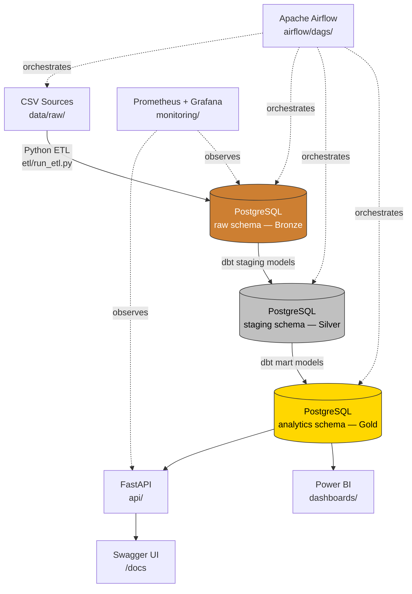

# E-commerce Customer Analytics Platform

An end-to-end analytics platform for e-commerce customer data — built with PostgreSQL, Python, dbt, Airflow, FastAPI, Docker, and Power BI.

Raw order/customer data flows through a Bronze → Silver → Gold warehouse, gets transformed into RFM, CLV, cohort, and churn models, and is served through a REST API and BI dashboards — all orchestrated by Airflow and containerized with Docker.

## Architecture



Airflow runs the daily pipeline: `ETL → dbt run → dbt test → dbt docs`.

Full design docs: [`docs/architecture.md`](docs/architecture.md) · [`docs/ERD.md`](docs/ERD.md) · [`docs/HLD.md`](docs/HLD.md) · [`docs/LLD.md`](docs/LLD.md) · [`docs/diagrams/`](docs/diagrams) (Mermaid sources)

## Tech Stack

| Layer | Technology |
|---|---|
| Database | PostgreSQL 16 |
| ETL | Python (Pandas, SQLAlchemy) |
| Transform | dbt |
| Orchestration | Apache Airflow |
| API | FastAPI |
| Dashboard | Power BI |
| Containerization | Docker Compose |
| CI/CD | GitHub Actions |
| Monitoring | Prometheus + Grafana |

## Repository Layout

```
├── data/               sample source CSVs + generator script
├── sql/schema/         DDL: schemas, dim/fact tables, constraints, indexes
├── sql/analytics/      20+ SQL queries — RFM, CLV, cohort, churn, market basket
├── etl/                Python extract/load scripts (Bronze loader)
├── dbt/                staging + mart models, tests, docs
├── airflow/dags/       DAG: ETL → dbt run → dbt test
├── api/                FastAPI service (KPI, RFM, CLV, product endpoints)
├── dashboards/         Power BI connection guide
├── docs/diagrams/      Mermaid diagram sources (architecture, ERD, lineage, DAG)
├── monitoring/         Prometheus + Grafana config
├── tests/              unit tests for ETL and API
└── .github/workflows/  CI: lint, tests, dbt build
```

## Quickstart

```bash
git clone https://github.com/Rohitprajapat067/E-commerce_Customer_Analytics_Platform.git
cd E-commerce_Customer_Analytics_Platform
cp .env.example .env

# Bring up Postgres, Airflow, API, monitoring
docker compose up -d --build

# Load sample data into the raw (Bronze) schema
docker compose exec api python -m etl.run_etl

# Build the warehouse (Silver + Gold)
docker compose exec api bash -c "cd /app/dbt/ecommerce_analytics && dbt run && dbt test"
```

| Service | URL |
|---|---|
| API + Swagger docs | http://localhost:8000/docs |
| Airflow UI | http://localhost:8080 (`admin` / `admin`) |
| Grafana | http://localhost:3000 |
| PostgreSQL | `localhost:5432` |

## Analytics Covered

- **RFM segmentation** — Recency, Frequency, Monetary scoring
- **Customer Lifetime Value (CLV)** — historical + predictive
- **Cohort retention** — monthly acquisition cohorts
- **Churn indicators** — days-since-last-order, cancellation rate
- **Market basket analysis** — product affinity / co-purchase pairs
- **Revenue KPIs** — AOV, running totals, category/country breakdowns via window functions

Raw SQL lives in [`sql/analytics/`](sql/analytics); the same logic is modeled and tested in [`dbt/ecommerce_analytics/models/marts`](dbt/ecommerce_analytics/models/marts).

## Power BI

`.pbix` files aren't included since they're binary and environment-specific — see [`dashboards/README.md`](dashboards/README.md) for a connection guide and the four suggested dashboards (Executive KPI, Customer, Product, Revenue), all built on the `analytics` (Gold) schema.

## Testing & CI

```bash
pytest tests/ -v
```

GitHub Actions runs linting and unit tests on every push (`ci.yml`), plus a full `dbt build` against an ephemeral Postgres instance (`dbt_ci.yml`) to catch model and data-quality regressions.

## Deployment

See [`docs/deployment_guide.md`](docs/deployment_guide.md) for the AWS EC2 + RDS + S3 path.

## License

MIT — see [`LICENSE`](LICENSE).
