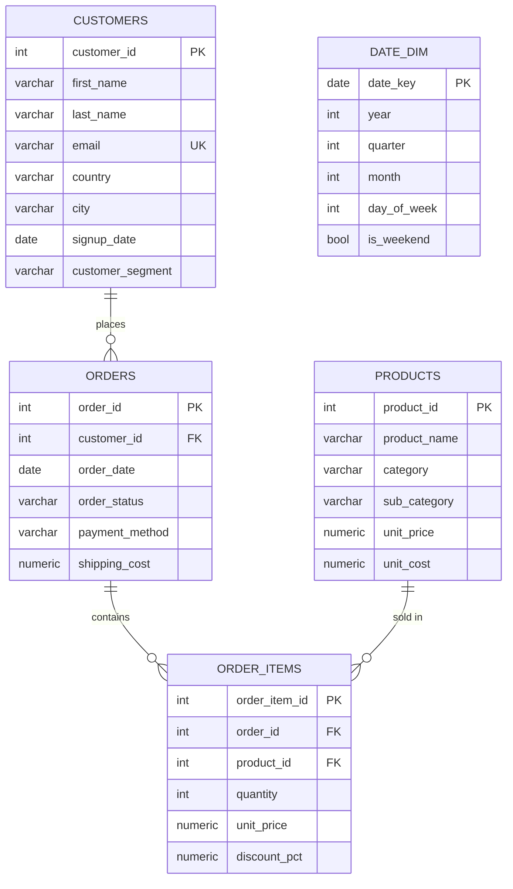

# Entity-Relationship Diagram

## Bronze layer (`raw` schema)

## Gold layer (`analytics` schema, built by dbt)

| Table | Grain | Description |
|---|---|---|
| `dim_customers` | 1 row / customer | Customer attributes + lifetime order stats |
| `dim_products` | 1 row / product | Product attributes + sales stats |
| `fct_orders` | 1 row / order | Order header + derived revenue/total |
| `customer_rfm` | 1 row / customer | RFM scores + segment label |
| `customer_clv` | 1 row / customer | Historical + predicted annual CLV |

`fct_orders.customer_id` references `dim_customers.customer_id`; `dim_products` joins to `fct_orders` via `raw.order_items` in the underlying staging models.
