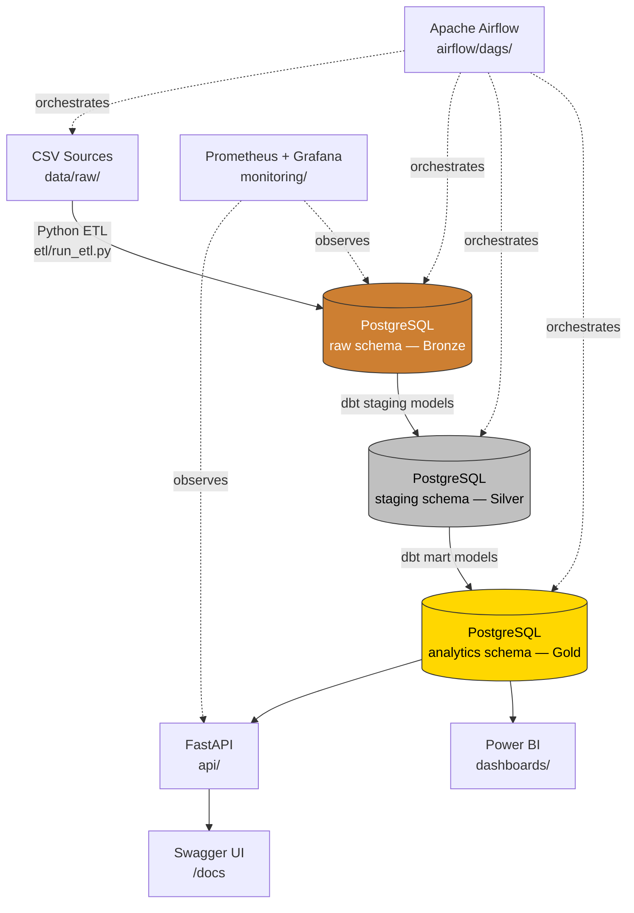

# Architecture Overview

## Data Flow



Source: [`docs/diagrams/architecture.mmd`](diagrams/architecture.mmd)

## Text Summary

```
CSV sources (data/raw/)
      │
      ▼  etl/run_etl.py  (Pandas + SQLAlchemy)
PostgreSQL "raw" schema  ── Bronze ──────────────────
      │
      ▼  dbt staging models (models/staging/*.sql)
PostgreSQL "staging" schema ── Silver ─── cleaned, typed, tested
      │
      ▼  dbt mart models (models/marts/*.sql)
PostgreSQL "analytics" schema ── Gold ─── dims, facts, RFM, CLV
      │
      ├──► FastAPI (api/) ──► JSON KPI endpoints, Swagger at /docs
      │
      └──► Power BI ──► Executive / Customer / Product / Revenue dashboards

Apache Airflow (airflow/dags/ecommerce_analytics_dag.py) orchestrates:
  extract_and_load_bronze -> dbt deps -> dbt run -> dbt test -> dbt docs generate

Prometheus + Grafana (monitoring/) observe the running containers and
can be extended to scrape API/DB metrics.
```

## Medallion Layers

| Layer | Schema | Owner | Description |
|---|---|---|---|
| Bronze | `raw` | Python ETL | Source CSVs loaded as-is (typed, FK-constrained) |
| Silver | `staging` | dbt | Cleaned, deduplicated, standardized |
| Gold | `analytics` | dbt | Business marts: dimensions, facts, RFM, CLV |

## Why this shape

- **ETL vs ELT split**: Python owns *extraction and loading* (the parts that talk to external/raw sources); dbt owns *transformation* (the parts that need testing, versioning, and lineage). This keeps each tool doing what it's best at.
- **Star schema in Gold**: `dim_customers`, `dim_products`, `fct_orders` follow a conventional star schema so Power BI can build relationships directly without extra modeling.
- **Idempotent loads**: dimension tables (customers, products) use full-refresh (truncate + reload); the orders fact table supports incremental loads keyed on `order_date` so repeated Airflow runs don't reprocess history.
- **Tests as a quality gate**: dbt's `not_null`, `unique`, `relationships`, and `accepted_values` tests run in CI and in the Airflow DAG before docs are published, so broken data never silently reaches the dashboards.

See also: [`ERD.md`](ERD.md), [`HLD.md`](HLD.md), [`LLD.md`](LLD.md), [`deployment_guide.md`](deployment_guide.md).
